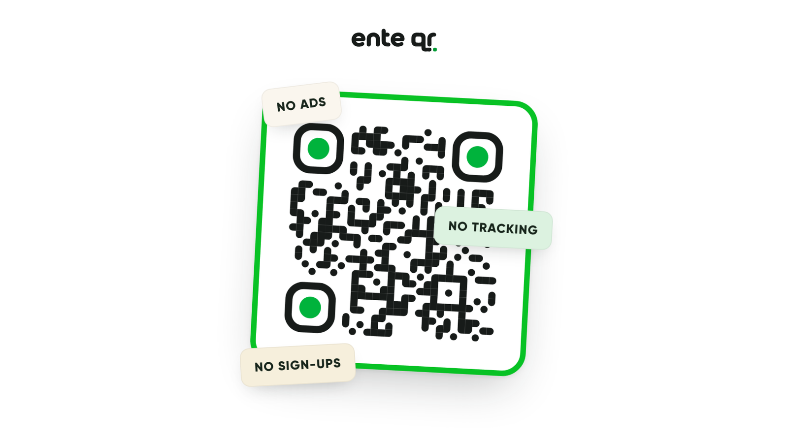

# ente qr



A QR code generator that keeps to itself. Paste a link, style the code, download it. Everything happens in the browser.

Most free QR tools put *their* link inside your code and redirect through their servers, so they can count every scan and switch the code off later. This one encodes your link directly. Nothing is uploaded, nothing is stored, and no account is needed. Once you download a code it works forever, with or without this site.

## What it does

- Rounded, square and dotted module styles, with separate corner and eye shapes
- Colours for the code, the eyes and the background, plus a colour picker
- Your logo in the middle, with shape, size, padding and a white backing plate
- Frames with your own label, baked into every export
- PNG and SVG export from 512 to 2048 px, or copy straight to the clipboard
- A share card that turns the code into a story-sized image

## Run it

```
python3 -m http.server 4519
```

Then open http://localhost:4519. Opening `index.html` directly works too.

## Deploy

Any static host. `_headers` carries the CSP and security headers, `_redirects` maps `/blog` to `/why`.

Note that `connect-src` in `_headers` must keep `data:` and `blob:` — the QR library inlines logo images over XHR, and dropping them silently breaks logo embedding on the live site.

## Files

| Path | What it is |
|------|-----------|
| `index.html` | the tool |
| `why.html` | the story behind it, served at `/why` |
| `fonts/` | Gilroy (licensed) and Gochi Hand (OFL, licence included) |
| `blog-assets/` | the screen recording used on `/why` |
| `_headers`, `_redirects` | host config |

## Licence

Gochi Hand ships under the SIL Open Font License, included at `fonts/GochiHand-OFL.txt`. Gilroy is a commercial font used under licence.
